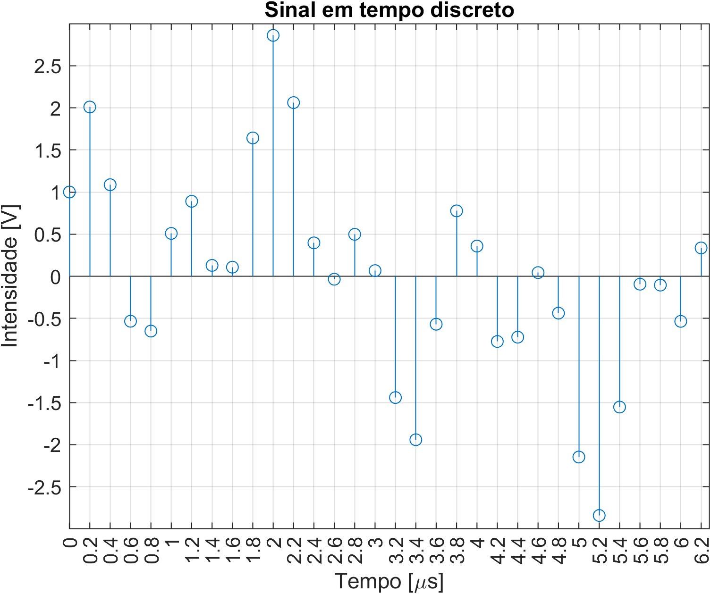

# 1. Plot de funções

Nesta pasta, temos exemplos de plots simples de funções, sejam elas contínuas, discretas, 1D, 2D etc.

## Dicas gerais

[A FAZER]

Uma referência muito boa é o [MATLAB Plot Cheatsheet](https://github.com/peijin94/matlabPlotCheatsheet), um guia gráfico que tem várias dicas em uma imagem só.

## 1.1 `plot_seno.m`

Apresenta um plot básico da função seno, com eixo x configurado para ir de pi em pi unidades.

Quando você executar o código no MATLAB, o resultado deve ser o seguinte gráfico:

## 1.2 `plot_sinal_discreto.m`

Apresenta um plot de um sinal em tempo discreto, usando a função `stem` ao invés da função `plot`. Além disso, apresenta:

- Títulos em figuras
- Etiquetas em eixo x e y
- Unidades nos eixos
- Mudanças no intervalo das marcas("ticks") nos eixos, para maior precisão

Quando você executar o código no MATLAB, o resultado deve ser o seguinte gráfico:

